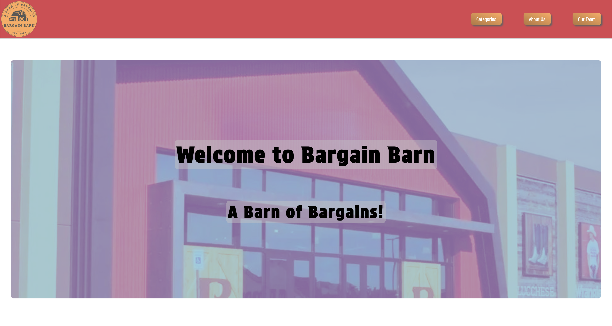

# Flexbox Buisness Site

## Table of Contents
- [Description](#description)
- [License](#license)
- [Contact](#contact)

[Click Me](https://drbubblez.github.io/flexbox-business-site/) to view the site.

## Description

This is project was created to practice using flexbox to create a responsive business site. The site is a fictional business site for a company called "Bargain Barn". This was a project was for Codecademy and is showcasing my ability to use flexbox. This entire project was created using HTML and CSS from scratch.

## License

This project is licensed under the MIT License.

## Contact

- Name: Harrison Miner
- Email: harrisonminer59@gmail.com
- LinkedIn: [Harrison Miner](https://www.linkedin.com/in/harrison-d-miner/)